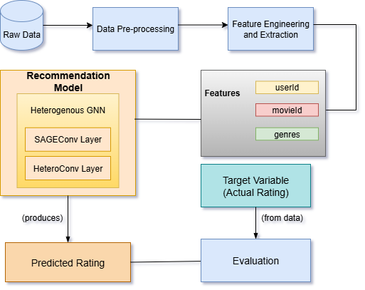

# heterogeneous-gnn-movie-recommender-system

* A movie recommender system using Heterogeneous Graph Neural Networks (HGNNs) on the MovieLens dataset.
* Includes data preprocessing, feature engineering, user/item embeddings, model training, and evaluation for user behavior analysis and node classification.
---
## Table of Contents
- [Overview](#overview)
- [Features](#features)
- [Installation](#installation)
- [Usage](#usage)
- [Dataset](#dataset)
- [Model Architecture](#model-architecture)
- [Results](#results)
- [Contributing](#contributing)
- [License](#license)
---
## Overview
* This project implements a scalable movie recommender system using Heterogeneous Graph Neural Networks (HGNNs) trained on the MovieLens-32M dataset.
* The project demonstrates advanced graph-based modeling for user behavior analysis, node classification, and recommendation, leveraging both user and movie features.
---
## Features
- Data preprocessing and cleaning
- Feature engineering for users and movies
- User/movie embeddings generation
- Heterogeneous GNN (SAGEConv, HeteroConv layers)
- Predicts movie ratings for users
- Evaluation with MAE, MSE, RMSE, R², MAPE
- User activity and node classification analysis
---
## Installation
1. Clone this repository:
    ```bash
    git clone https://github.com/yourusername/heterogeneous-gnn-movie-recommender-system.git
    cd heterogeneous-gnn-movie-recommender-system
    ```
2. Install dependencies:
    ```bash
    pip install -r requirements.txt
    ```
   *(Make sure to create a `requirements.txt` with packages like: numpy, pandas, torch, torch-geometric, matplotlib, scikit-learn, etc.)*
---
## Usage
- Configure your dataset path in the script or notebook as needed.
- Run the main training script:
    ```bash
    python train.py
    ```
- Explore analysis and EDA notebooks for data exploration and visualization.
---
## Dataset
- Download the [MovieLens-32M Dataset](https://grouplens.org/datasets/movielens/32m/)
---
## Model Architecture
* The recommendation model is built using a Heterogeneous GNN framework that utilizes SAGEConv and HeteroConv layers to effectively model user-movie interactions and learn embeddings for both node types.  
>   
---
## Results
| Metric  | Value   |
|---------|---------|
| MAE     | 0.5000  |
| MSE     | 0.3750  |
| RMSE    | 0.6124  |
| R²      | 0.9486  |
| MAPE    | 32.74%  |
---
## Contributing
* Pull requests are welcome. For significant changes, please open an issue first to discuss your proposal.
---
## License

This project is licensed under the MIT License.
